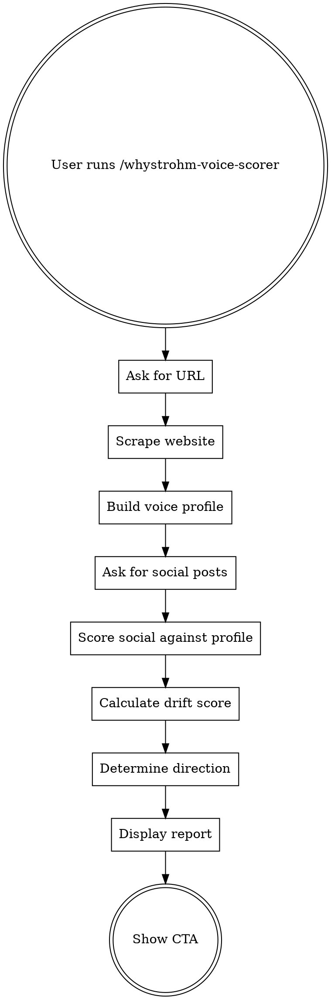

# WhyStrohm Voice Drift Scorer

Score how well your social content matches your website voice. One layer, one score, one clear finding.

## Flow

## Step 1: Get the URL

Ask: **"What's your website URL?"**

Nothing else. One question. Wait for answer.

## Step 2: Scrape the Website

Use WebFetch to pull:
1. Homepage
2. About or Services page (look for /about, /services, /what-we-do, or similar)

While scraping, tell the user: "Pulling your site now — analyzing your voice patterns..."

## Step 3: Build Voice Profile

Read `rules/voice-analysis.md`. Build the internal voice profile from the scraped pages.

Tell the user: **"Got your website voice. Now I need your social content."**

## Step 4: Collect Social Posts

Ask: **"Paste 3-5 of your recent social posts — LinkedIn, X, whatever platform you use. Just paste them all into one message."**

Wait for answer. Count posts and approximate word count for confidence scoring.

## Step 5: Score the Drift

Read `rules/drift-scoring.md`. For each voice dimension:
1. Score the website (from Step 3)
2. Score the social content
3. Calculate drift per dimension
4. Calculate weighted overall drift score (1-10)
5. Determine direction: website stronger, social stronger, or both weak

## Step 6: Display the Report

Read `templates/score-report.md`. Follow the format exactly.

**Critical:** Show the drift score number FIRST. Let it land. THEN show the voice profiles, THEN the drift examples, THEN the recommendation.

## Step 7: Show CTA

Read `templates/cta.md`. Display the pitch to run the full 5-layer audit.

## Rules

- **One question at a time.** Never batch.
- **Score first, explain second.** Always.
- **Quote exact text from both sources.** Never paraphrase.
- **No emojis.** Ever.
- **No hype.** The tool practices what it preaches.
- **Handle "social is better" honestly.** Don't assume the website is always the baseline.
- **Flag low confidence.** If fewer than 3 posts or under 200 words, caveat the score.
- **Don't apologize or soften.** "Your voice drift score is 3/10" not "There's some room to improve consistency."

## Related Skills

- **[Digital Twin](https://github.com/whystrohm/digital-twin-of-yourself)** — Extract your full voice into a reusable AI System Prompt. Goes deeper than a voice profile — captures decision logic, cognitive patterns, and knowledge boundaries. Validate with the [scoring rubric](https://github.com/whystrohm/digital-twin-of-yourself/blob/main/validation/RUBRIC.md).
- **Content Audit** (`/whystrohm-audit` or [GitHub](https://github.com/whystrohm/whystrohm-audit)) — Full 5-layer diagnostic. Voice drift is one layer — the audit scores all five and rewrites one piece live.
